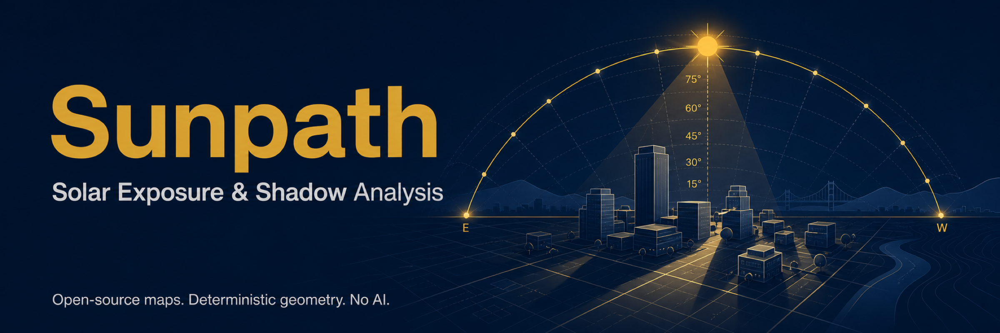
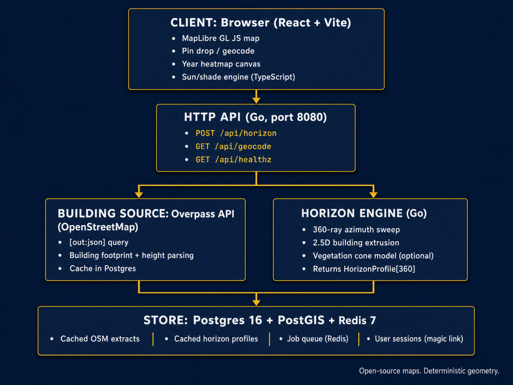

<p align="center">
  
</p>

<p align="center">
  <strong>Solar Exposure &amp; Shadow Analysis</strong><br />
  Drop a pin on a map and discover how much direct sunlight that point receives across any day of the year.
</p>

<p align="center">
  <a href="#stack">Stack</a> •
  <a href="#architecture">Architecture</a> •
  <a href="#quick-start">Quick Start</a> •
  <a href="#configuration">Configuration</a> •
  <a href="#project-structure">Structure</a> •
  <a href="#license">License</a>
</p>

---

Sunpath answers a question that no clean consumer app currently owns well: **how much direct sunlight does a specific point receive, and when**. A user drops a pin on a map (a terrace, a balcony, a future flat, a garden bed, a cafe seat) and Sunpath computes when that point is in direct sun versus in the shadow of surrounding buildings, across any day of the year.

The primary deliverable is a year-round solar exposure profile: a daily sun-hours figure, a month-by-month heatmap, key dates (solstices, equinoxes, best/worst days), and a plain-language summary.

## Stack

| Layer | Technology | Purpose |
|-------|-----------|---------|
| **Client** | React 18 + Vite + TypeScript | Reactive UI, MapLibre GL JS map, canvas heatmap |
| **API** | Go (1.25) | REST endpoints, horizon computation, caching |
| **Buildings** | Overpass API (OpenStreetMap) | On-demand building footprint + height fetch |
| **Cache & Queue** | Postgres 16 + PostGIS + Redis 7 | Cached OSM extracts, horizon profiles, job queue |
| **Auth** | Magic-link (email only, no passwords) | Optional accounts for saved projects |
| **Maps** | MapLibre GL JS + open vector tiles | No proprietary token required |

## Architecture

<p align="center">
  
</p>

The core abstraction: a **horizon profile** — 360 elevation-angle samples (one per compass degree) representing the maximum obstruction angle of surrounding buildings. This is computed once on the backend and cached. The client then computes sun position for any date/time using cheap astronomy math and checks it against the horizon profile. The entire year can be explored interactively with zero additional backend calls.

## Quick Start

### Prerequisites

- Go 1.25+
- Node.js 20+
- Docker Desktop (optional, for Postgres + Redis)

### Docker (recommended)

```bash
cp .env.example .env
docker compose -f docker-compose.prod.yml -f docker-compose.local.yml up --build -d
```

Open [http://localhost:3000](http://localhost:3000).

### Manual

```bash
# Backend
cd backend
go run ./cmd/sunpathd &

# Frontend
cd frontend
cp ../.env.example .env
npm install
npm run dev
```

Open [http://localhost:5173](http://localhost:5173).

## Configuration

Copy `.env.example` to `.env` and set:

| Variable | Default | Description |
|----------|---------|-------------|
| `TILE_STYLE_URL` | `https://demotiles.maplibre.org/style.json` | Map tile style URL |
| `OVERPASS_URL` | `https://overpass-api.de/api/interpreter` | Overpass API endpoint |
| `POSTGRES_PASSWORD` | (required) | Password for Postgres |
| `LISTEN_ADDR` | `:8080` | Backend listen address |
| `ELEVATION_API_URL` | (optional) | DSM elevation API for terrain shadows |

## Project Structure

```
sunpath/
  backend/              Go backend
    cmd/sunpathd/         Server entrypoint
    cmd/worker/           Background job worker
    cmd/migratedb/        Database migration tool
    internal/api/         HTTP handlers, routing, middleware
    internal/geo/         Geo types, polygons, extrusion
    internal/horizon/     Horizon profile engine (core)
    internal/osm/         Overpass client, building parsing, cache
    internal/veg/         Vegetation cone shadow model
    internal/sun/         Solar position algorithm
    internal/store/       Store interface + Postgres adapter
    internal/queue/       Redis job queue
    internal/auth/        Magic-link authentication
    internal/dsm/         Digital surface model (terrain shadows)
  frontend/             React + Vite frontend
    src/
      components/         Map, heatmap, panels, sliders
      lib/                Sun engine, horizon consumer, timezone
      public/             Service worker, icons, manifest
  docs/
    assets/               Banner and architecture images
    ARCHITECTURE.md       Design decisions
    API.md                Endpoint documentation
  docker-compose.yml      Development compose
  docker-compose.prod.yml Production compose
```

## License

MIT &mdash; see [LICENSE](LICENSE).
